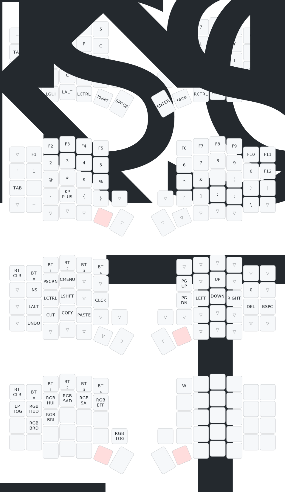

# Default keymap

## Tutorial:
Tham khảo [hướng dẫn gốc của shop](https://github.com/Hieupham0012/KEYMAP-ZMK_GUIDE_Cornev4_Soflev4).
1. Fork lại repo này.
2. Sử dụng [Keymap editor](https://nickcoutsos.github.io/keymap-editor/) làm GUI chỉnh sửa keymap. Cấp quyền access vào Repo của mình để thực hiện keymap.
3. Sau khi thao tác trên keymap editor, ấn Save để thực hiện commit vào repo, từ đó trigger Github Actions workflow.
4. Vào tap **Actions** của repo, ấn vào workflow gần nhất, cùng tên với commit message ở bước 3. Tải file firmware ở mục Artifacts về rồi unzip.
5. Flash firmware vào bàn phím: cắm bàn phím vào máy, rồi dùng que chọc sim chọc vào lỗ dưới màn hình để reset. **Chọc giữ 2 giây, rồi nhả, rồi chọc tiếp 1 cái**. Làm đúng thì bàn phím sẽ hiện ra trên máy tính dưới dạng một thư mục.
6. Copy file firmware `.uf2` vào thư mục. Nhớ copy đúng file `left` và `right` vào đúng bên bàn phím. Xong thì thư mục bàn phím sẽ tự động biến mất.
